# 如何写一个与原生沟通的插件

## 1.构建一个插件

1. 构建一个插件

   ```javascript
   // xxx为那个你喜欢的唯一名
   // -a指定安卓开发语言,默认Swift
   // -i指定ios开发语言,默认Kotlin
   flutter create --template=plugin --platforms=android,ios -i objc -a java xxx
   ```

2. 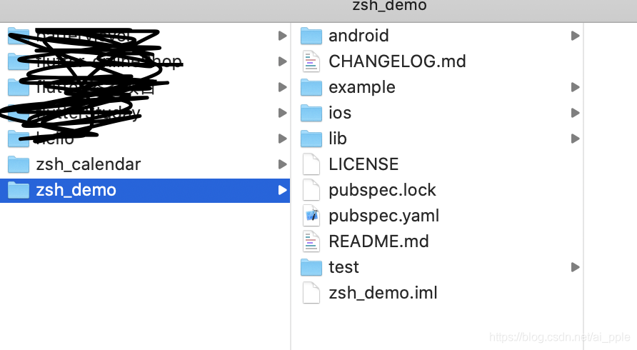

## 2.概念

1. channel 主要有 methodChannel 和 eventChannel 2种,还有一种BasicMessageChannel没了解过
   1. 区别,一个是流的形式,一个不是
2. stream 流 ,有2种流, 单一流(只能有一个监听者)和广播流 
   1. stream常和StreamBuilder联合使用
   2. 更多关于流的内容推荐阅读
      1. https://www.didierboelens.com/2018/08/reactive-programming-streams-bloc/
      2. https://medium.com/flutter-community/understanding-streams-in-flutter-dart-827340437da6
      3. https://medium.com/flutter-community/why-use-rxdart-and-how-we-can-use-with-bloc-pattern-in-flutter-a64ca2c7c52d 
3. Protoful
   1. 序列化数据结构的协议
   2. 在写插件的过程中,常常需要相互传递大量数据,如果只用字典或字符串并不理想
   3. Protoful可以定义数据结构体, 执行命令就可以实现自动将结构体和二进制数据的相互转化代码完成,省时省力

## 3.使用

### 1. flutter调用原生方法(带/不带参数 有/无返回值)

####    flutter端

1. 定义MethodChannel, 一个插件可以有多个MethodChannel,为了唯一性,建议channel名字带有前缀

2. flutter端代码--在lib文件夹下写

   1. 删掉zsh_demo.dart里的代码,新建立demo_channel.dart专门定义channel,新建立function.dart文件专门负责交互方法

   2. 文件结构如图

       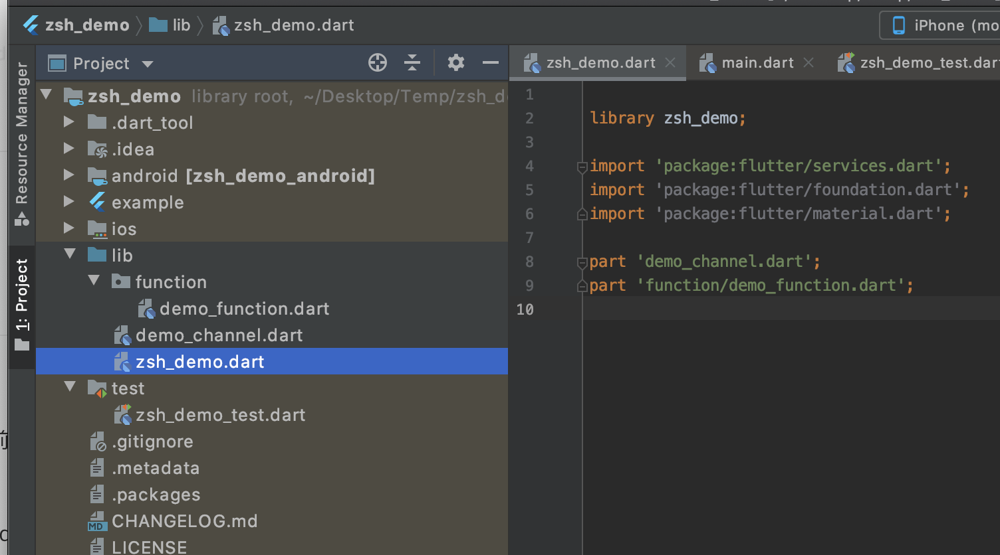

   3. zsh_demo.dart只导入资源文件,代码如上;

   4. demo_channel.dart专门定义cahnnel, 如下: 

      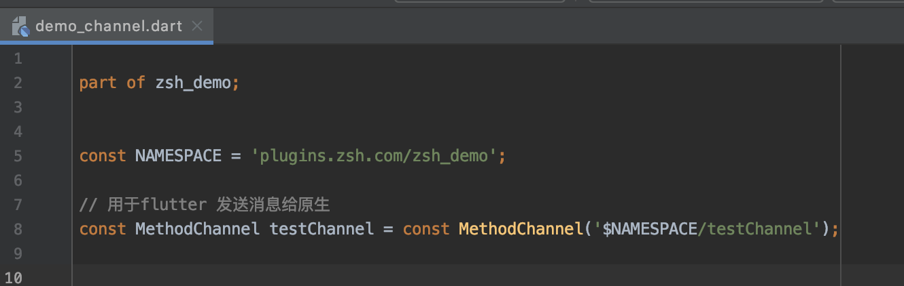

   5. demo_function.dart专门写方法,如下:

       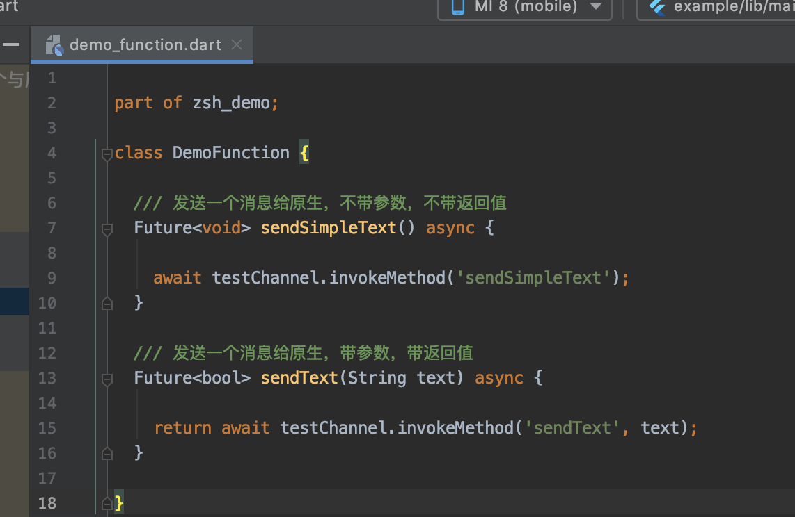

   6. 以上,flutter端完事

   7. 写ios和安卓端代码之前,先到example下依次执行flutter build ios, 和 flutter build apk, 这样才能打开带插件又能运行demo的代码

#### ios端

1. 目录ios右键------> flutter ------> Open ios module in Xcode

2. Runner里的只是demo代码,写插件的代码在Pods下,如图:

   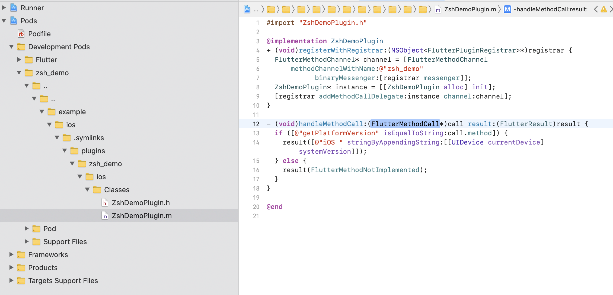

3. 注册channel,注册后,flutter发送给原生的方法会走代理handleMethodCall:(FlutterMethodCall*)call result:(FlutterResult)result

4. 

#### 安卓端

1. 目录android右键------> flutter ------> Open Android module in Android Studio
2. 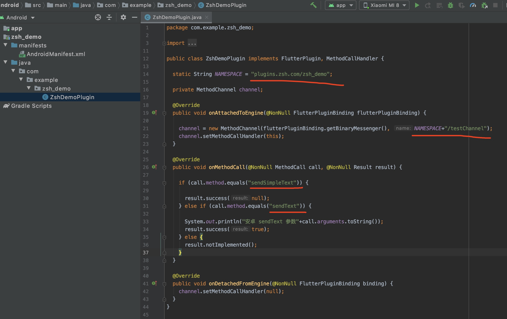

### 2. 原生调用flutter方法

原生调用flutter方法和上面相同,只是invokeMethod由原生调用, 监听由flutter监听

#### flutter端

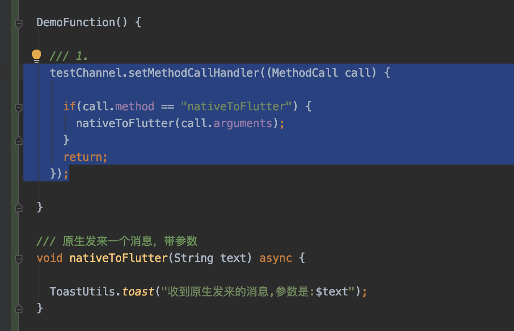

#### ios端和安卓端

```
/// 安卓方
channel.invokeMethod("nativeToFlutter", "安卓 参数");

/// ios方
[self.channel invokeMethod:@"nativeToFlutter" arguments:@"ios 参数"];
```

#### 配合stream使用

1. 假设有个需求, 我们的插件收到了参数,处理后,要把值显示在UI上,怎么处理

2. 方法: 借助stream流实现, ios和安卓端都不需要修改, 把flutter方的代码修改成如下

   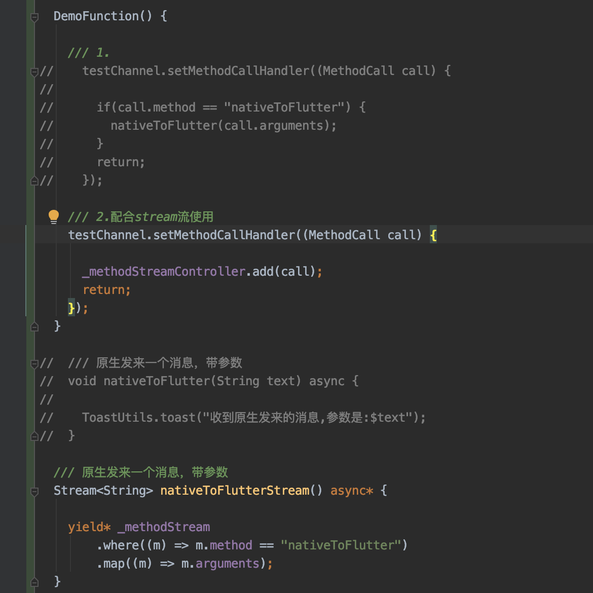

3. 使用该插件的项目,就可以利用streamBuildr来实现监听结果了

   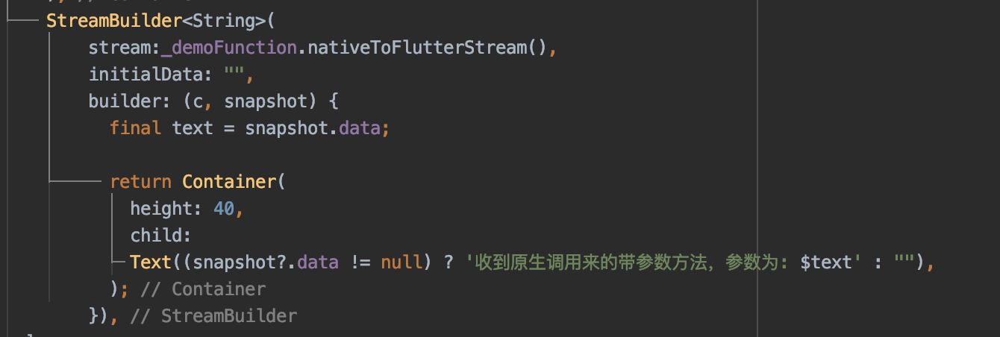

### 3. flutter显示原生view

#### flutter端

1. flutter端,和ios的交互是利用的UiKitView, 和安卓是利用的AndroidView

2. 根据不同平台,使用不同的widget来加载, viewType是不同端之间沟通的唯一标识,需要唯一性和一致性

   ##### 1.demo_channel新添常量viewType的唯一标识字符串

   ```javascript
   const String LABEL_VIEW = '$NAMESPACE/labelView';
   ```

   ##### 2.定义接口

   ```
   
   part of zsh_demo;
   
   abstract class PlatformView {
   
     Widget build({
       BuildContext context,
     });
   }
   ```

   ##### 3.ios平台的view

   ```javascript
   part of zsh_demo;
   
   class IosLabelView implements PlatformView {
   
     @override
     Widget build({BuildContext context}) {
   
       return UiKitView(
         viewType: LABEL_VIEW,
       );
     }
   }
   ```

   ##### 4.安卓平台的view

   ```
   part of zsh_demo;
   
   class AndroidLabelView implements PlatformView {
   
     @override
     Widget build({BuildContext context}) {
   
       return AndroidView(
         viewType: LABEL_VIEW,
       );
     }
   }
   ```

   ##### 5.构建外界使用的widget

   ```
   part of zsh_demo;
   
   
   
   // ignore: must_be_immutable
   class LabelWidget extends StatelessWidget {
   
     /// 执行build构建widget
     @override
     Widget build(BuildContext context) {
   
       return platform.build(context: context);
     }
   
     PlatformView _platform;
   
     set platform(PlatformView platform) {
       _platform = platform;
     }
   
     /// 根据不同平台创建不同的view
     PlatformView get platform {
       if (_platform == null) {
         switch (defaultTargetPlatform) {
           case TargetPlatform.android:
             _platform = AndroidLabelView();
             break;
           case TargetPlatform.iOS:
             _platform = IosLabelView();
             break;
           default:
             throw UnsupportedError(
                 "Trying to use the default webview implementation for $defaultTargetPlatform but there isn't a default one");
         }
       }
       return _platform;
     }
   }
   ```

#### ios端

1. 运行以上flutter代码,会将viewType为 LABEL_VIEW的消息发到ios端,ios实现FlutterPlatformViewFactory接口方法既可

   1. .h文件

      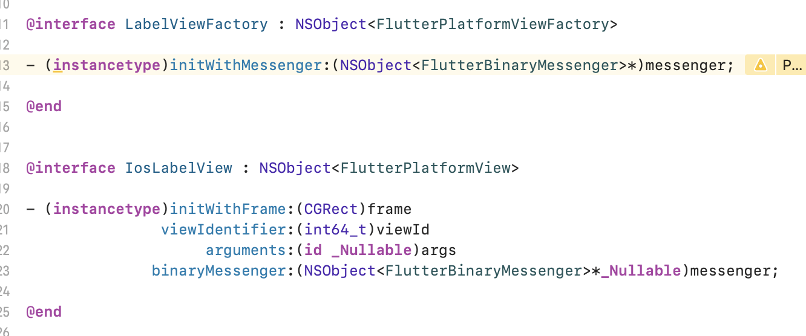

   2.  .m文件

      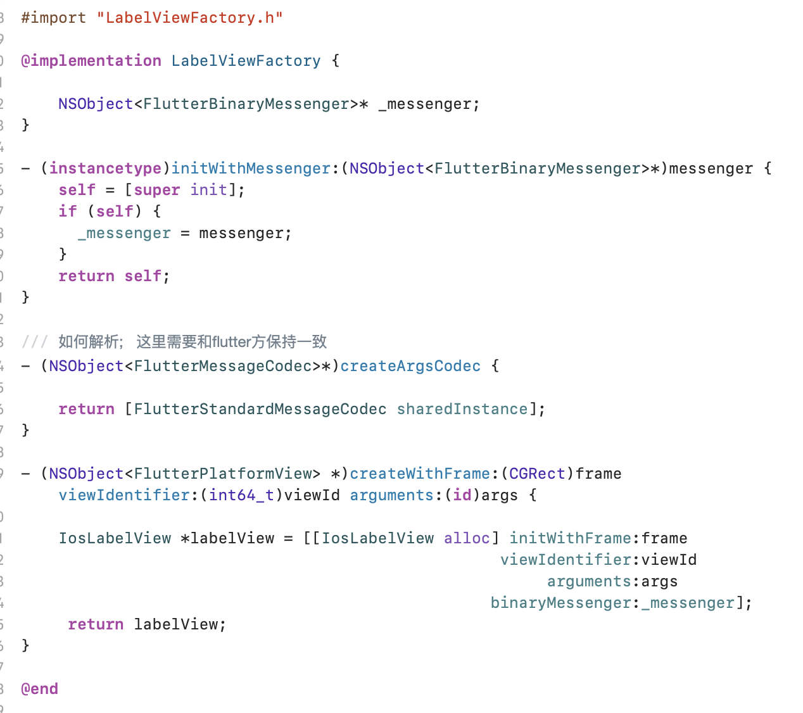

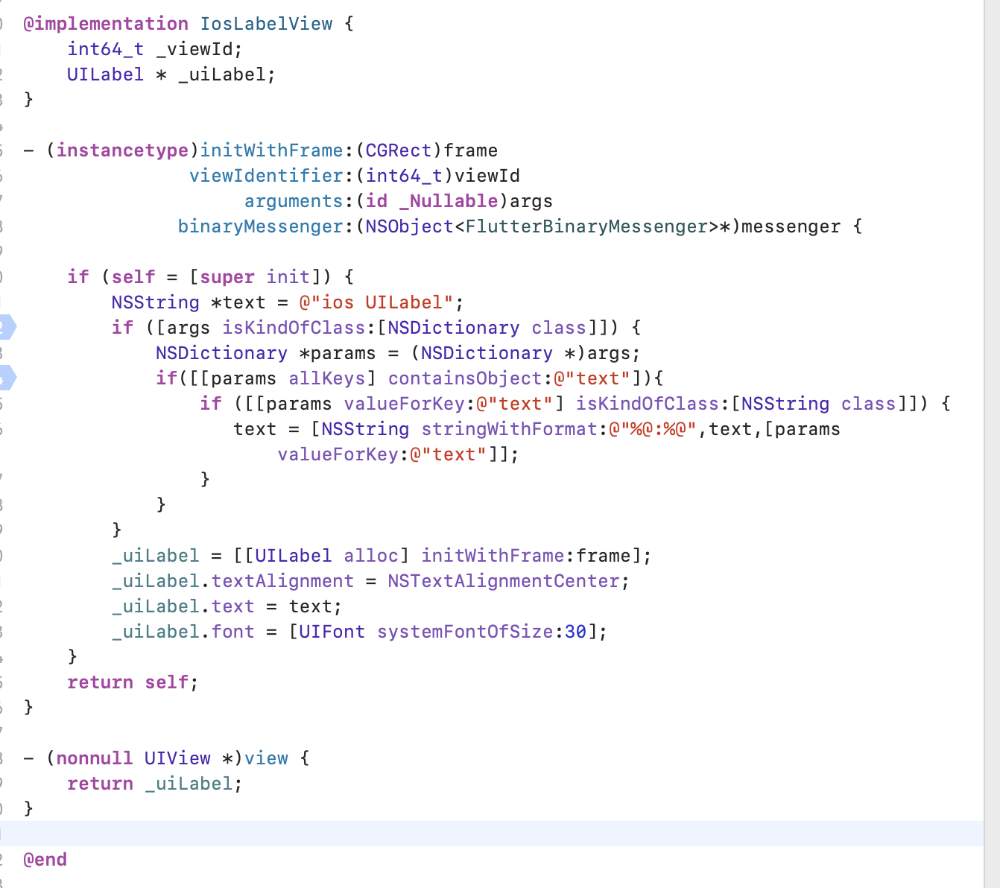

3. 注册, 在registerWithRegistrar:方法里注册Factory

   ```
    LabelViewFactory* webviewFactory =
            [[LabelViewFactory alloc] initWithMessenger:registrar.messenger];
       
    NSString *viewType = [NSString stringWithFormat:@"%@/labelView",NAMESPACE];
    [registrar registerViewFactory:webviewFactory withId:viewType];
   ```

#### 安卓端

和ios方思路相同,如下:

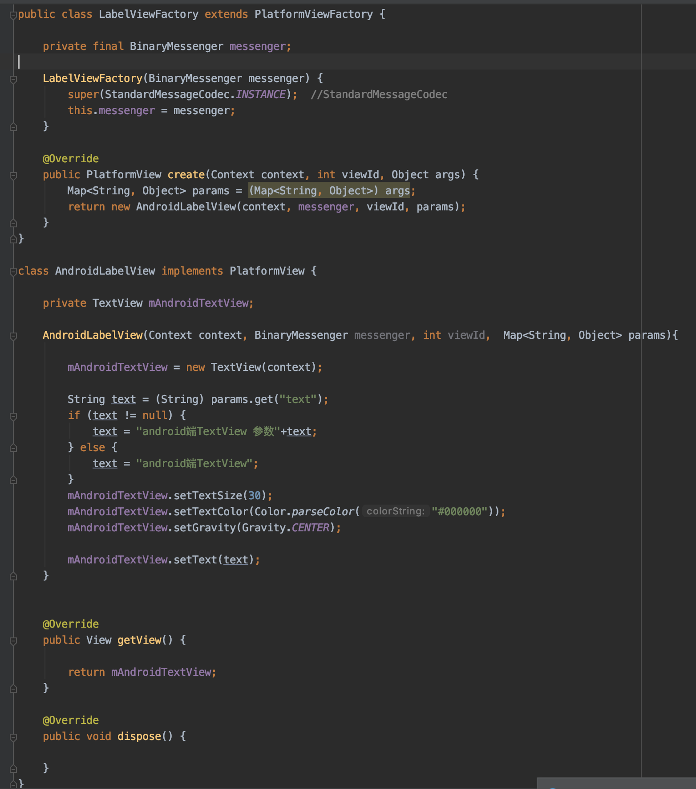

同样,注册factory


#### flutter让原生view更新数据

在三端,都能看到viewId这个int值,viewType_viewid就是这个view实例在原生与flutter沟通的唯一channnel 的id

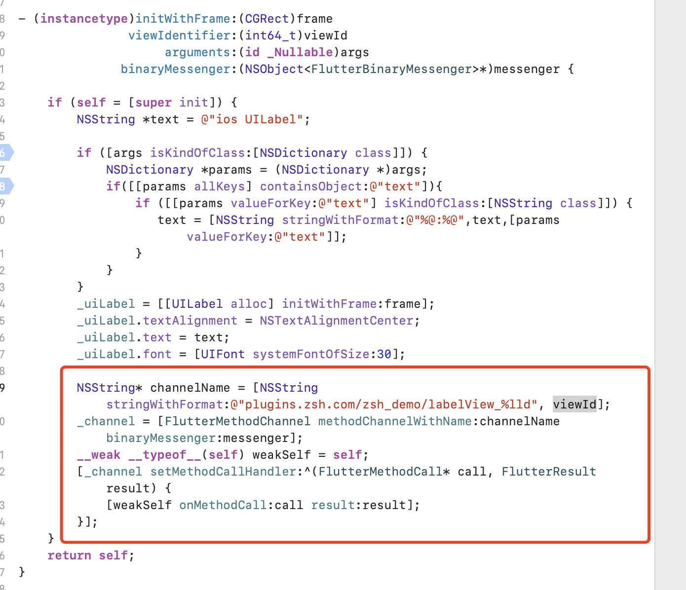

这样就可以实现沟通了,flutter端,安卓端相同,不重复

### 4. 原生显示flutter widget(暂无)

### 5.flutter监听原生数据流

1. 以上都只介绍了methodChannel, 还有一种channel就是eventChannel
2. eventChannel是以流的形式进行的channel, 常用于需要不断传输到另一端的事件,比如蓝牙发送到手机的数据的监听, IM收到消息的监听等

#### flutter端

1. 定义eventChannel

   ```
   const EventChannel eventChannel = const EventChannel('$NAMESPACE/receive');
   ```

2.  定义方法

   ```
    /// 收到监听
     Stream<String> receiveMessageStream() async* {
   
       yield* eventChannel
           .receiveBroadcastStream()
           .map((text) => text);
     }
   ```

3. 使用该插件的项目使用方式

   ```
     StreamBuilder<String>(
                   stream:_demoFunction.receiveMessageStream(),
                   initialData: "",
                   builder: (c, snapshot) {
                     final text = snapshot.data;
   
                     return Container(
                       height: 40,
                       child:
                       Text((snapshot?.data != null) ? '收到消息 $text' : ""),
                     );
                   }),
   ```

#### ios端

1. 实现协议FlutterStreamHandler

   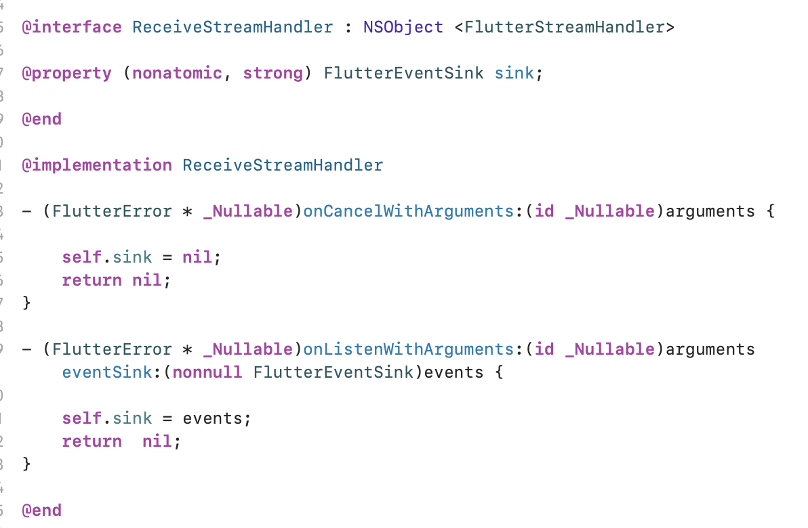

2. 注册

   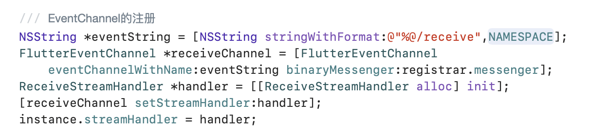

3. 给sink添加内容

    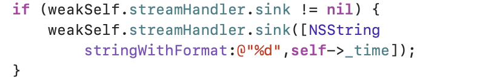

#### 安卓端

1. 实现协议

   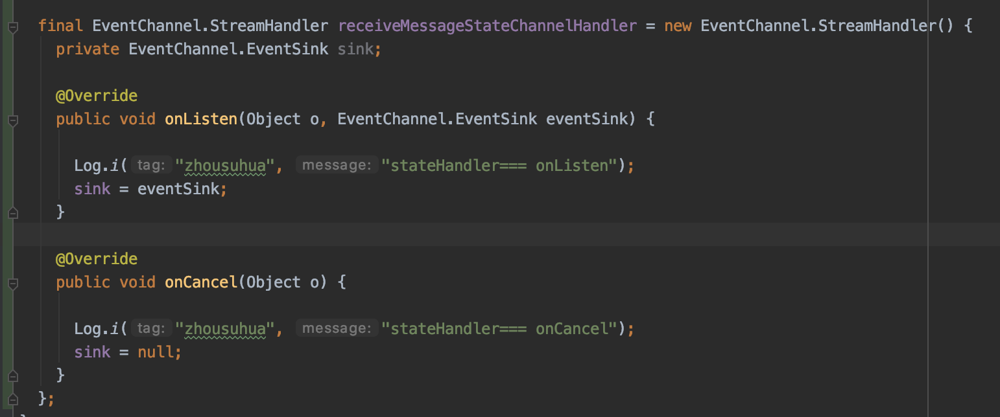

2. 注册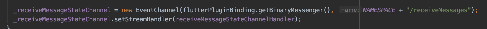

3. 给sink添加内容

   ```
   sink.success("1000");
   ```

## 4.更优的数据交互:Protoful

#### 安装

安装protoc

```
brew install protobuf
```

查看版本验证安装是否成功

```
protoc --version
```

安装dart

```
brew tap dart-lang/dart
brew install dart
```

安装protoc_plugin

```
pub global activate protoc_plugin
```

安装完成后会提示.bash_profile添加一条指令，添加既可,如下：

```
export PATH="$PATH":"$HOME/.pub-cache/bin"
```

#### 写.proto文件

这里指定protoful使用第三版

java_package对应android下的build.gradle下的package

java_outer_classname和objc_class_prefix都是类名指定前缀

```
syntax = "proto3";


option java_package = "com.example.zsh_demo";
option java_outer_classname = "Protos";
option objc_class_prefix = "Protos";


message NIMAutoLoginData {

    string account = 1;
    string token = 2;
    bool forcedMode = 3;
    NIMLoginStep step = 4;
}

message NIMLoginStep {

  enum State {
    UN_KNOW = 0;
    UN_LOGIN = 1;
    FORBIDDEN = 2;
    VER_ERROR = 3;
  };
  State state = 1;
}
```

#### flutter生成

来到项目跟目录，在控制台输入

./lib 表示在当前文件夹下的lib文件下生成目标文件

./proto/*.proto 表示执行./proto/路径下所有proto结尾的文件

```
protoc --dart_out=./lib ./proto/*.proto
```

执行成功后，可以看到路径下多了如下内容

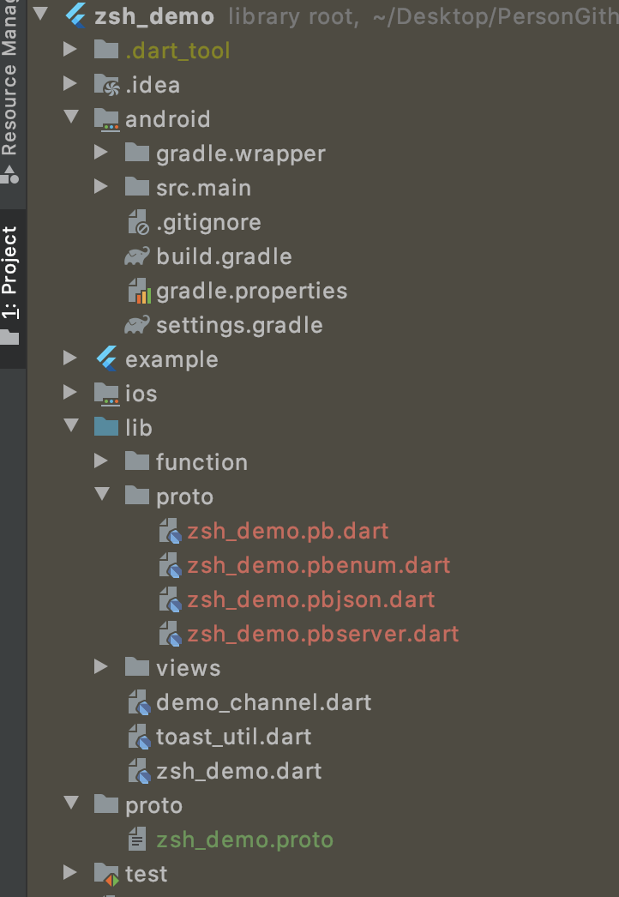

#### ios端生成

ios端添加Protobuf资源

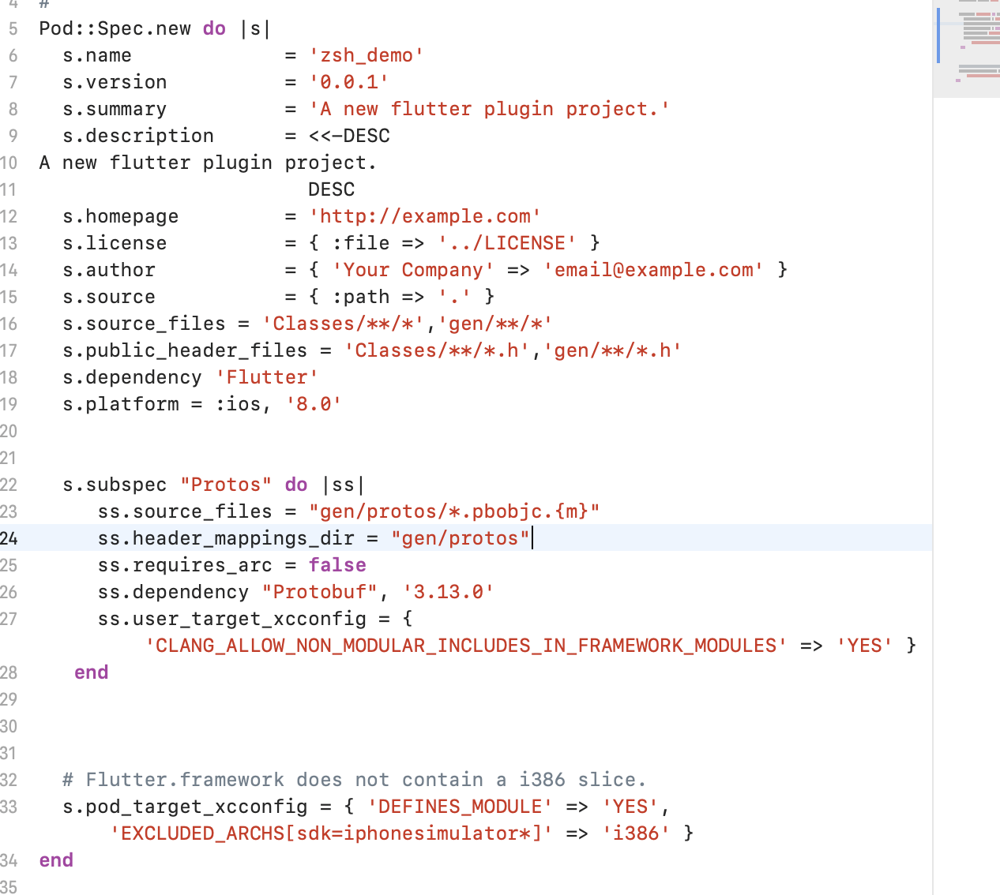

来到example下的iOS， 执行 pod install , 安装protoful

在ios下新建立gen文件，之后来到项目跟目录，执行

```
protoc --objc_out=./ios/gen ./proto/*.proto
```

执行成功后，依然到cd example/ios 后执行pod install

这时候会看到该项目ios下，多了 如下内容

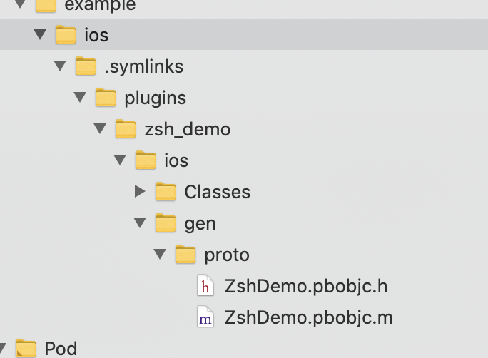

#### 安卓端生成

在android的build.gradle下添加如下内容

1. classpath 'com.google.protobuf:protobuf-gradle-plugin:0.8.10'

2. apply plugin: 'com.google.protobuf'

3.  

   ```
   sourceSets {
       main {
           proto {
               srcDir '../protos'
           }
       }
   }
   ```

4.  

   ```
   protobuf {
       // Configure the protoc executable
       protoc {
           // Download from repositories
           artifact = 'com.google.protobuf:protoc:3.9.1'
       }
       plugins {
           javalite {
               // The codegen for lite comes as a separate artifact
               artifact = 'com.google.protobuf:protoc-gen-javalite:3.0.0'
           }
       }
       generateProtoTasks {
           all().each { task ->
               task.plugins {
                   javalite { }
               }
           }
       }
   }
   ```

5.  implementation 'com.google.protobuf:protobuf-lite:3.0.1'

 如下: 

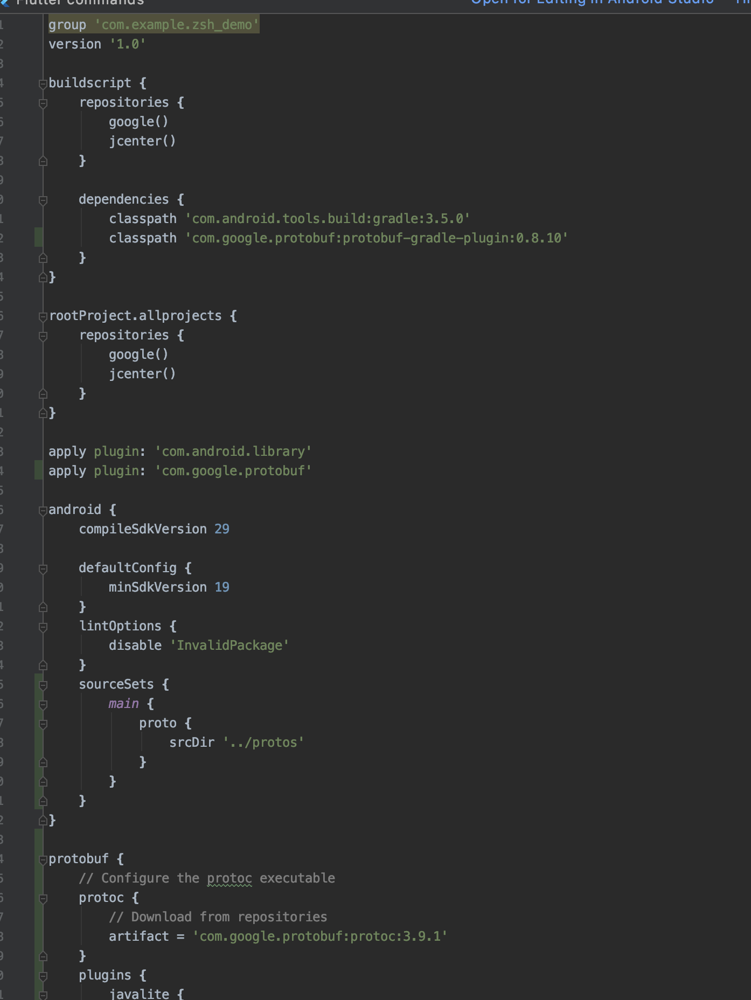

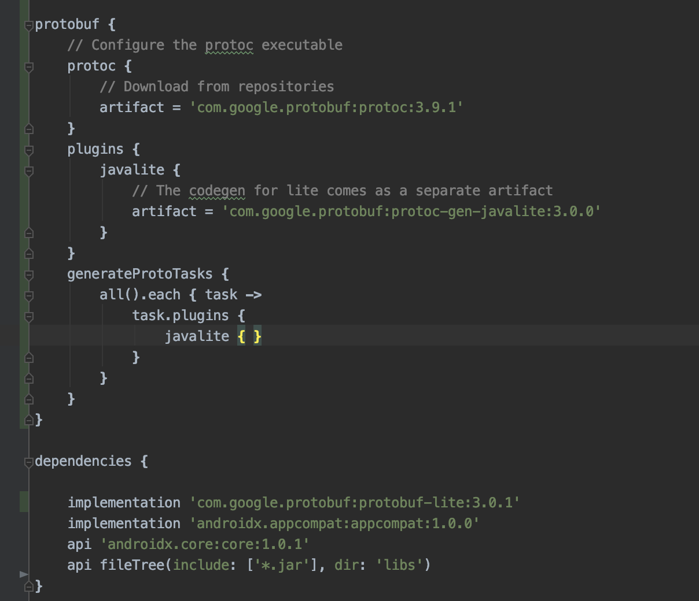

#### 使用protoful交互数据

dart传protoful数据给原生

```
var customProto = protos.NIMTipMessageArguments.create()
  ..session = session.getProto()
  ..tipContent = tipContent;
return await CHAT_CHANNEL.invokeMethod('sendTip', customProto.writeToBuffer());
```

原生接收protoful数据

ios端

```
guard let data = call.arguments as? FlutterStandardTypedData else {
    return result(false)
}
let sourceArgumentProto = try ProtosNIMTipMessageArguments(data: data.data)
```

安卓端

```
byte[] data = call.arguments();
Protos.NIMTipMessageArguments arguments;
arguments = Protos.NIMTipMessageArguments.newBuilder().mergeFrom(data).build();
```

