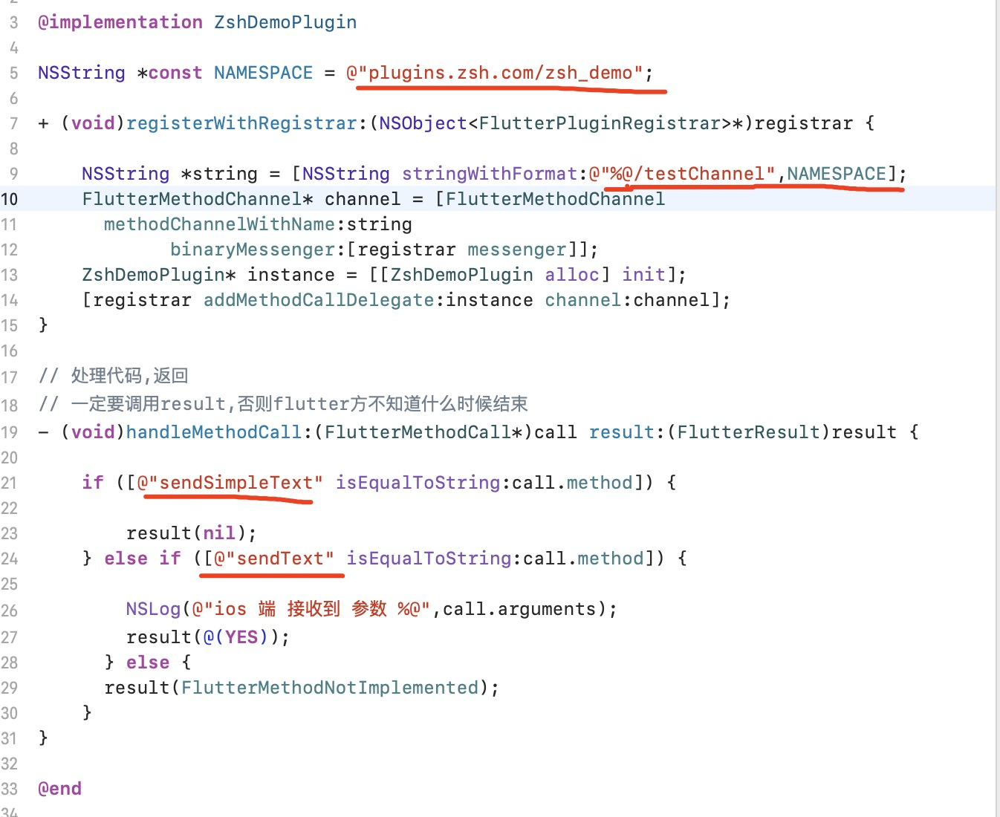

# 如何写一个与原生沟通的插件

## 1.构建一个插件

1. 构建一个插件

   ```javascript
   // xxx为那个你喜欢的唯一名
   // -a指定安卓开发语言,默认Swift
   // -i指定ios开发语言,默认Kotlin
   flutter create --template=plugin --platforms=android,ios -i objc -a java xxx
   ```

2. 

## 2.概念


## 3.使用

### 1. flutter调用原生方法(带/不带参数 有/无返回值)

####    flutter端

1. 定义MethodChannel, 一个插件可以有多个MethodChannel,为了唯一性,建议channel名字带有前缀

2. flutter端代码--在lib文件夹下写

   1. 删掉zsh_demo.dart里的代码,新建立demo_channel.dart专门定义channel,新建立function.dart文件专门负责交互方法

   2. 文件结构如图

       

   3. zsh_demo.dart只导入资源文件,代码如上;

   4. demo_channel.dart专门定义cahnnel, 如下: 

      

   5. demo_function.dart专门写方法,如下:

       

   6. 以上,flutter端完事

   7. 写ios和安卓端代码之前,先到example下依次执行flutter build ios, 和 flutter build apk, 这样才能打开带插件又能运行demo的代码

#### ios端

1. 目录ios右键------> flutter ------> Open ios module in Xcode

2. Runner里的只是demo代码,写插件的代码在Pods下,如图:

   

3. 注册channel,注册后,flutter发送给原生的方法会走代理handleMethodCall:(FlutterMethodCall*)call result:(FlutterResult)result

4. 

#### 安卓端

1. 目录android右键------> flutter ------> Open Android module in Android Studio
2. 

### 2. 原生调用flutter方法


### 3. flutter显示原生view

#### flutter让原生view更新数据

### 4. 原生显示flutter widget

### 5.flutter监听原生数据流

#### 和invote区别

#### stream的几种

## 4.更优的数据交互:Protoful